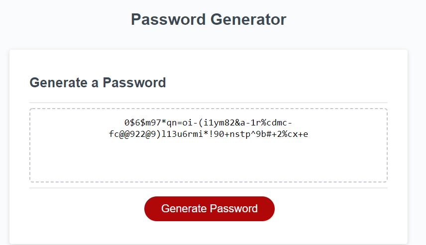

# Challenge 3
## Password Generator

This is a password generator that I've ceated using javascript.

https://avamariee.github.io/password-generator/

> You can choose from a range between 8 and 128 total characters.
>
> You can select from 4 character types: lowercase letters, uppercase letters, numbers, and special characters.
>
> Once you have selected your preferred character types and length, the password will print in the middle of the page.
>
> If no valid paramaters are selected, you will receive a notification and it will print "undefined".
>
> At this point you can then press "generate password" again, select valid options, and it will override the "undefined" and print your password.

